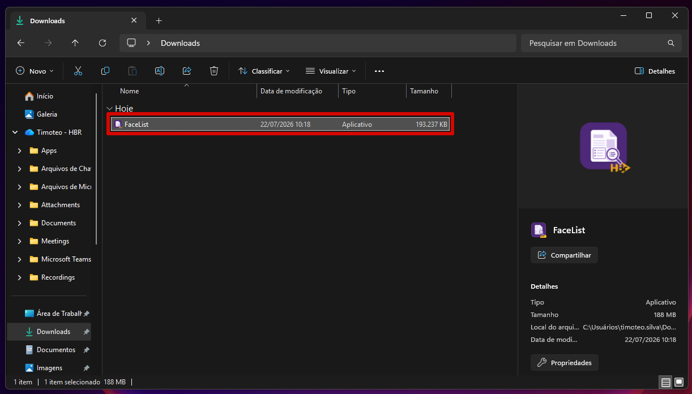
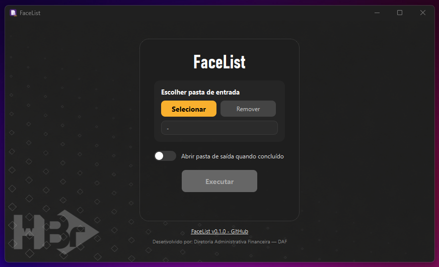
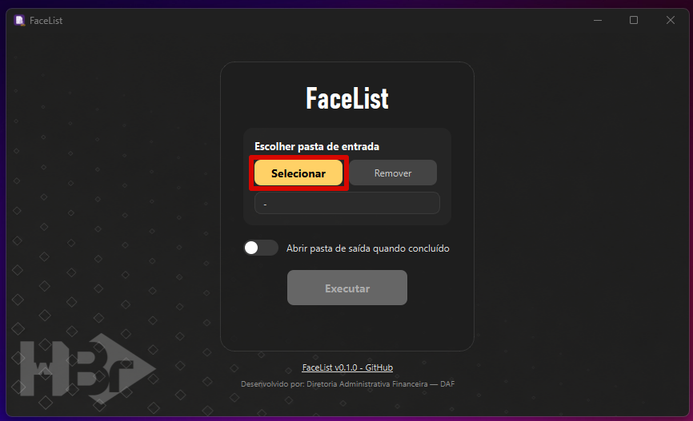
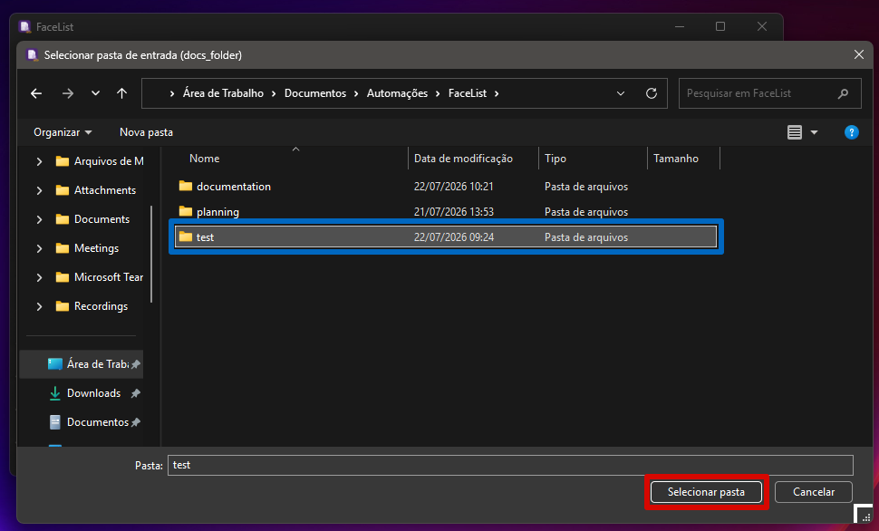
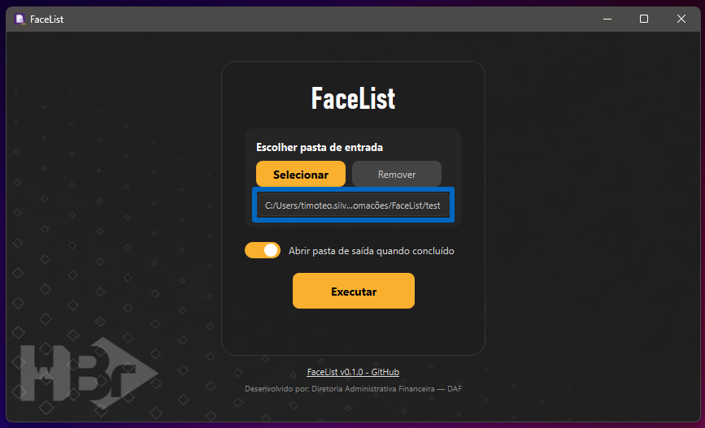
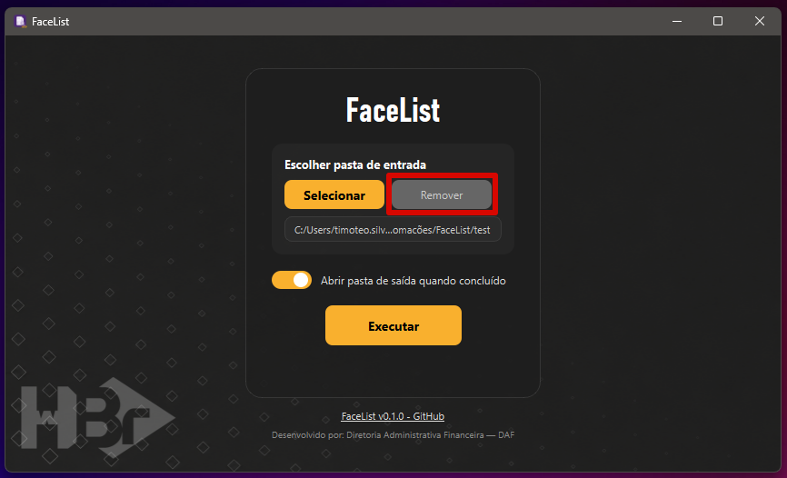
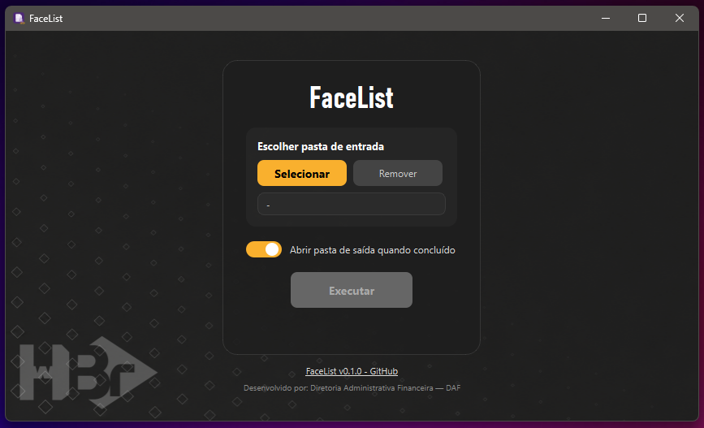
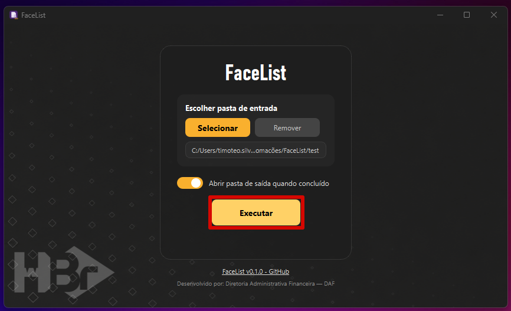
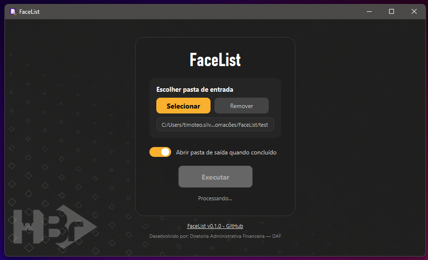
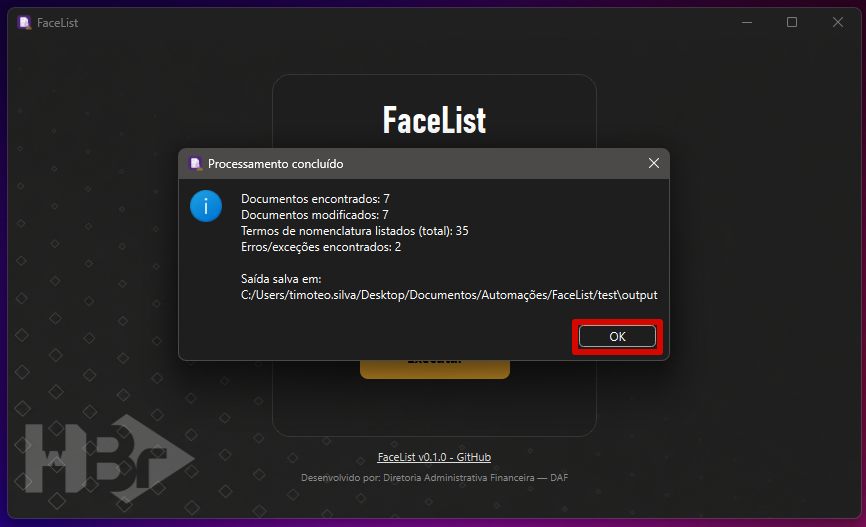

# FaceList

Repositório oficial do programa FaceList, para listar as seções de documentos de Prestação de Contas em suas folhas de rosto.

## 1. Requisitos

Para uso adequado do programa, o usuário deve possuir:
- **Sistema Operacional:** Windows 10 ou 11

## 2. Guia de Uso

### 2.1 Baixando e Instalando o Programa

Para usar o `FaceList`, primeiro, você deve baixar o arquivo `.exe` disponível [aqui](https://github.com/imbaTIMvel/facelist/releases). Procure pela versão mais recente (*Latest*) e clique no arquivo `.exe` para fazer o download.

> [!Warning]
> Caso você ainda tenha o executável de uma versão antiga do programa, recomenda-se excluí-lo.

Baixado o programa, você pode colocar o arquivo `.exe` onde achar melhor.

### 2.2 Abrindo o Programa

Feito isso, clique no arquivo `.exe` para abrir o programa.

> [!Warning]
> É possível que o *Windows Defender* acuse o programa como "software perigoso". Neste caso, para executá-lo, você deve clicar em `Mais Informações` e, depois, no botão `Executar assim mesmo`.

Antes de iniciar uma operação, junte os documentos (PDFs) a serem modificados em uma **única pasta**.

### 2.3 Interface do Programa

#### 2.3.1 Pasta de Entrada

O programa possui um único campo para a seleção da pasta com os documentos que se quer modificar. Para selecionar a pasta de entrada, deve-se clicar no botão `Selecionar`. Feito isso, o programa abre um diálogo do *Explorador de Arquivos*, permitindo que o usuário encontre e selecione a pasta desejada.

Após selecionar a pasta, o campo de seleção é atualizado.

Para remover a pasta selecionada, deve-se clicar no botão `Remover`.

#### 2.3.2 Botão de Execução

Selecionada a pasta, ao clicar no botão `Executar`, o programa processa os arquivos na pasta de entrada, lendo cada um (via *parsing*) e buscando as palavras-chave que servem para identificar onde cada seção do documento começa - listando-as na folha de rosto. 

> [!Warning]
> O programa lê apenas os **PDFs** dentro da pasta de entrada selecionada.

Ao final do processamento, o programa salva os PDFs modificados dentro de um diretório `output`, criado dentro da pasta de entrada selecionada. Os documentos originais permanecem inalterados. Adicionalmente, é criado um documento de texto `error_logs.txt` (salvo também na pasta `output`), onde são registrados os erros e exceções do algoritmo.

## 3. Releases

### `v0.1.0` FaceList (*beta release*)

> [!Warning]
> O lançamento beta (*beta release*) foi desenvolvido para **testes internos**, visando identificar e corrigir bugs antes do lançamento de uma versão estável.

Data de lançamento: `22/07/2026`

Para fazer o download desta versão, clique [aqui](https://github.com/imbaTIMvel/facelist/releases/download/v0.1.0/FaceList.exe).

*Release* inicial do programa de separação e nominação automática de comprovantes.

**Features:**

- Analisa automaticamente todos os arquivos PDF presentes em uma pasta e seus subdiretórios;
- Procura palavras-chave e combinações de termos previamente configuradas para reconhecer as seções existentes em cada documento;
- Compila todas as seções identificadas e as insere como uma caixa de texto na folha de rosto (primeira página) do PDF;
- Salva os documentos modificados em um diretório `output`, mantendo os arquivos originais inalterados;
- Gera um arquivo `error_logs.txt` contendo exceções, documentos inválidos, PDFs ilegíveis, ausência de palavras-chave, problemas na folha de rosto e demais ocorrências durante o processamento.

Clique [aqui](https://github.com/imbaTIMvel/facelist/releases) para acessar o **changelog completo**.

## 4. Desenvolvimento

#### Autor:

Timóteo Altoé (*handle:* [imbaTIMvel](https://github.com/imbaTIMvel))

#### Datas:

`08/07/2026` Início do projeto

`21/07/2026` Lançamento da versão *alfa* - para testes internos

`22/07/2026` Publicação da primeira versão oficial no GitHub

`22/07/2026` Lançamento da versão *beta* - para testes
